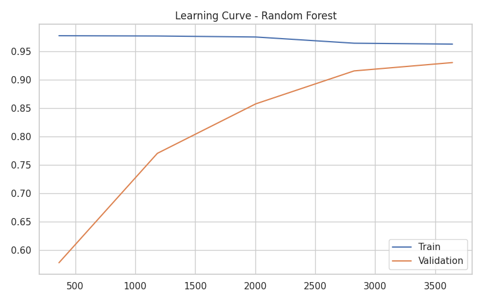

# 🔥 Machine Learning Internship Projects (Level 3)

This repository contains advanced Machine Learning tasks completed as part of my internship assignment.  
Each task demonstrates skills in **data preprocessing, model building, hyperparameter tuning, and evaluation**.  
All models and assets are saved for reproducibility.

---

## 📂 Project Structure
```
Task1/
├── assets/                         # Visualizations and plots
│   ├── feature_importance.png      # Feature importance bar chart
│   ├── Learning_Curve.png          # Learning curve of model performance
│   └── confusion_matrix.png        # Confusion matrix heatmap
│
├── model/                          # Saved models and preprocessing objects
│   ├── scaler.pkl                  # StandardScaler object
│   ├── label_encoders.pkl          # LabelEncoders for categorical features
│   └── random_forest_model.pkl     # Trained Random Forest model
│
├── requirements.txt                # List of required Python libraries
├── randomforest-churn-task1.ipynb  # Full Task 1 implementation in a Jupyter Notebook
└── README.md                       # Documentation for the project
```

---

## 🔥 Task 1: Random Forest Classifier (Level 3)

This project focuses on predicting **customer churn** using a **Random Forest Classifier**.  
We used **SMOTE** to balance the dataset and **GridSearchCV** for hyperparameter tuning.

### 🔑 Key Details:
- **Dataset:** Churn Prediction Dataset
- **Model:** RandomForestClassifier
- **Techniques:** SMOTE, GridSearchCV, Cross-Validation

### 📊 Results:

| Metric                    | Value |
|---------------------------|-------|
| **Train Accuracy**        | 96.07% |
| **Test Accuracy**         | 94.30% |
| **CV Accuracy (Mean)**    | 93.20% |

**Best Hyperparameters:**  
```python
{'max_depth': 10, 'min_samples_leaf': 2, 'min_samples_split': 5, 'n_estimators': 100}
```

### 📈 Classification Report:
```
              precision    recall  f1-score   support

       False       0.97      0.97      0.97       572
        True       0.79      0.81      0.80        95

    accuracy                           0.94       667
   macro avg       0.88      0.89      0.88       667
weighted avg       0.94      0.94      0.94       667
```

### 🔍 Insights:
- Strong performance with balanced **precision/recall**.
- Feature importance shows key factors influencing customer churn.
- SMOTE improved detection of **minority class (Churn = True)**.

### 📷 Visualizations:



---

 ## feature_importances:
 Customer service calls    0.184369
Total day minutes         0.134878
International plan        0.117127
Total day charge          0.113497
Total intl calls          0.072628
Area code                 0.049199
Total eve minutes         0.045799
Total eve charge          0.042563
Total intl charge         0.031389
Total intl minutes        0.027953
Voice mail plan           0.024383
State                     0.023864
Number vmail messages     0.023531
Total night minutes       0.022739
Total night charge        0.021485
dtype: float64

---

## 🚀 How to Run:
1. Clone the repository:
```bash
git clone https://github.com/HoussemBouagal/machine-learning-internship-projects.git
cd machine-learning-internship-projects/Task1
```
2. Install dependencies:
```bash
pip install -r requirements.txt
```
3. Load and preprocess dataset.
4. Train or load `random_forest_model.pkl`.
5. View results in `assets/`.

---

## 🏆 Author
**Houssem Eddine Bouagal**  
Machine Learning Intern @ Codveda Technologies
