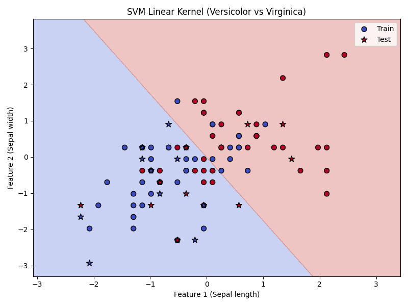
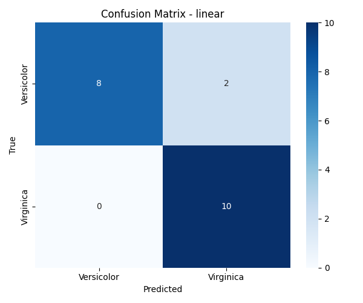
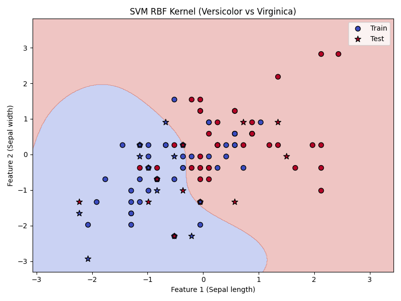
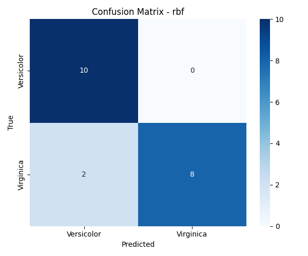

# 🔥 Task 2: SVM Classification (Iris Dataset - Level 3)

This project focuses on **binary classification** of the **Iris dataset** using **Support Vector Machines (SVM)** with both Linear and RBF kernels.  
The goal is to compare the performance of both kernels and visualize their decision boundaries.

---

## 📂 Project Structure
```
Task2/
├── linear_results/                         # Results and analysis for SVM with Linear kernel
│   ├── linear_confusion_matrix.png         # Confusion matrix image for Linear SVM
│   └── decision_boundary.png               # Visualization of decision boundary for Linear SVM
│
├── rbf_results/                            # Results and analysis for SVM with RBF kernel
│   ├── rbf_confusion_matrix.png            # Confusion matrix image for RBF SVM
│   └── decision_boundary.png               # Visualization of decision boundary for RBF SVM
│
├── model/                                  # Trained models and preprocessing objects
│   ├── svm_linear.pkl                      # Trained SVM model using Linear kernel
│   ├── svm_rbf.pkl                         # Trained SVM model using RBF kernel
│   └── scaler.pkl                          # StandardScaler object for feature normalization
│
├── svm-iris-classification.ipynb           # Full Task 2 implementation in a Jupyter Notebook
├── requirements.txt                        # List of required Python libraries
└── README.md                               # Documentation for the project and results

```

---

## 🔑 Key Details:
- **Dataset:** Iris Dataset (Versicolor vs Virginica)
- **Model:** Support Vector Machine (SVM)
- **Kernels Tested:** Linear, RBF
- **Techniques:** SMOTE for class balancing, StandardScaler for normalization
- **Metrics:** Accuracy, AUC, Confusion Matrix, Classification Report

---

## 📊 Results:

| Model          | Train Accuracy | Test Accuracy | AUC     |
|----------------|---------------|--------------|---------|
| **SVM Linear** | 97.50%        | 90.00%       | 1.0000  |
| **SVM RBF**    | 96.25%        | 90.00%       | 0.9700  |

---

### 📈 Classification Reports:

#### 🔹 Linear SVM
```
               precision    recall  f1-score   support

  Versicolor       1.00      0.80      0.89        10
   Virginica       0.83      1.00      0.91        10

    accuracy                           0.90        20
   macro avg       0.92      0.90      0.90        20
weighted avg       0.92      0.90      0.90        20
```

#### 🔹 RBF SVM
```
               precision    recall  f1-score   support

  Versicolor       0.83      1.00      0.91        10
   Virginica       1.00      0.80      0.89        10

    accuracy                           0.90        20
   macro avg       0.92      0.90      0.90        20
weighted avg       0.92      0.90      0.90        20
```

---

## 🔍 Insights:
- **Linear SVM** achieved perfect AUC (1.0000) and great accuracy.
- **RBF SVM** also performed similarly, showing robustness in separating the two classes.
- Both kernels perform well; **RBF** slightly adjusts to non-linear boundaries.
- Balanced dataset with **SMOTE** improved class recall.

---

## 📷 Visualizations:






---

## 🚀 How to Run:
1. Clone the repository:
```bash
git clone https://github.com/HoussemBouagal/machine-learning-internship-projects.git
cd machine-learning-internship-projects/Task2
```

2. Install dependencies:
```bash
pip install -r requirements.txt
```

3. Run the notebook:
```bash
jupyter svm-iris-classification.ipynb
```

4. Check results in `linear_results/` and `rbf_results/` folders.

---

## 🏆 Author
**Houssem Eddine Bouagal**  
Machine Learning Intern @ Codveda Technologies