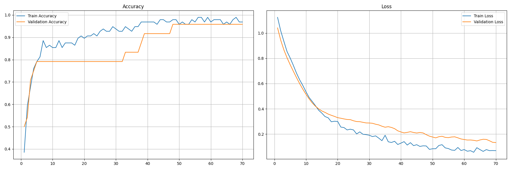

# 🔥 Task 3: Neural Networks with TensorFlow/Keras (Iris Classification)

This project demonstrates **Iris Flower Classification** using a **Neural Network** built with TensorFlow/Keras.  
The workflow includes **SMOTE balancing, normalization, callbacks (EarlyStopping, ModelCheckpoint), and visualization of metrics**.

---

## 📂 Project Structure
```
Task3/
├── model/                              # Trained models 
│   └── best_model.keras                # Best model saved during training
│
├── assets/                             # Plots & Visualizations
│   ├── confusion_matrix.png            # Confusion matrix heatmap
│   └── metrics_curves.png              # Accuracy & Loss curves
│
├── iris-deeplearning-analysis.ipynb    # Full Task 3 implementation in a Jupyter Notebook
├── requirements.txt                    # List of required Python libraries
└── README.md                           # Documentation for this project

```

---

## 🔑 Key Details
- **Dataset:** Iris Dataset
- **Model:** Fully Connected Neural Network
- **Framework:** TensorFlow/Keras
- **Techniques:** SMOTE, EarlyStopping, ModelCheckpoint
- **Goal:** Classify 3 Iris flower species (`Setosa`, `Versicolor`, `Virginica`)

---

## 🧠 Model Architecture
```python
Sequential([
    Dense(64, activation='relu', input_shape=(4,)),
    Dropout(0.2),
    Dense(32, activation='relu'),
    Dense(3, activation='softmax')
])
```

---

## 📊 Results
| Metric                 | Score    |
|------------------------|----------|
| **Train Accuracy**     | 97.92%   |
| **Validation Accuracy**| 95.83%   |
| **Test Accuracy**      | 93.33%   |

---

## 📈 Classification Report
```
               precision    recall  f1-score   support
setosa             1.00      1.00      1.00        10
versicolor         0.90      0.90      0.90        10
virginica          0.90      0.90      0.90        10
accuracy                               0.93        30
macro avg          0.93      0.93      0.93        30
weighted avg       0.93      0.93      0.93        30
```

---

## 📷 Visualizations
- **Confusion Matrix:** 
- **Training Curves:** 

---

## 🚀 How to Run
1. Clone the repository:
```bash
git clone https://github.com/HoussemBouagal/machine-learning-internship-projects.git
cd machine-learning-internship-projects/Task3
```
2. Install dependencies:
```bash
pip install -r requirements.txt
```
3. Run the notebook:
```bash
jupyter iris-deeplearning-analysis.ipynb
```
4. View results in `res-task3/`.

---

## 🏆 Author
**Houssem Eddine Bouagal**  
*Machine Learning Intern @ Codveda Technologies*
